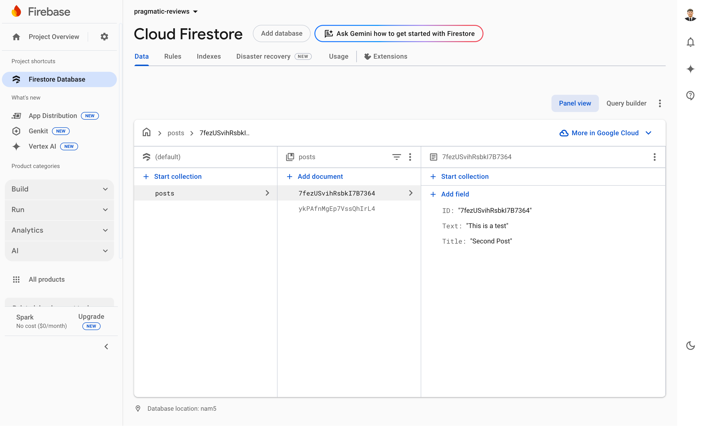

# Firebase Integration Documentation

## 🔥 Firebase Project Details

### Project Access

- **Firebase Console:** [Pragmatic Reviews Project](https://console.firebase.google.com/u/0/project/pragmatic-reviews-433b7)
- **Database Path:** `/posts/7fezUSvihRsbkI7B7364`

### Firebase Database Structure

Below is the current structure of our Firestore database:



## 📝 Database Collections

### Posts Collection

The database contains a `posts` collection with the following fields:

- `id`: Unique identifier
- `title`: Post title
- `text`: Post content

## 🔐 Security Rules

Important security rules to remember:

```javascript
rules_version = '2';
service cloud.firestore {
  match /databases/{database}/documents {
    match /{document=**} {
      allow read: if true;
      allow write: if request.auth != null;
    }
  }
}
```

## 🚀 Getting Started

1. Access the Firebase Console using the link above
2. Navigate to Firestore Database section
3. Use the provided database structure for reference

## 📌 Important Notes

- Make sure to handle authentication properly
- Keep the security rules updated
- Regular backups are recommended
